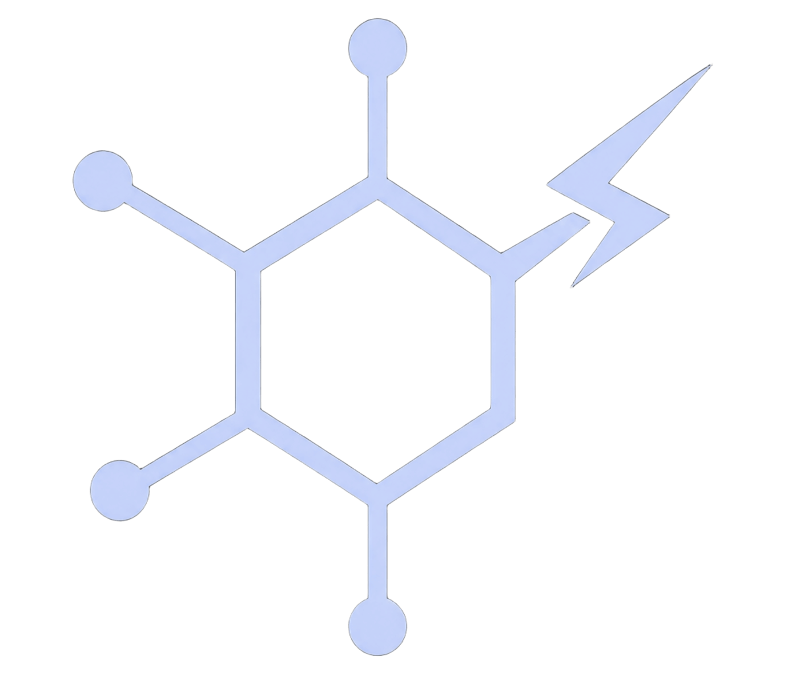

<h1 align="center">  DOPAMINE 💊​ <font size="3">v0.1.0</font></h1>


<font size="3">**⚠️​Warning⚠️**: This version (0.1.0) is a work in progress and may not be fully functional.</font>


https://github.com/user-attachments/assets/b859d6b8-571d-4a83-b7d5-2dd701205121


Dopamine is a modern Desktop shell for Quickshell. It is designed to be easy to customize and extend, while providing a clean and modern interface. 

## Features

- Modern, minimalistic design
- Easy to customize
- Based on Quickshell framework

## Quickstart

To get started with Dopamine, simply copy the contents of this directory to your Quickshell configuration directory and restart Quickshell.

## Repository Structure

```
dopamine/
  ├── shell.qml                  # Entry point
  ├── Config/
  │   └── config.qml             # Colors, fonts, sizes — everything centralized
  ├── Services/
  │   ├── Audio.qml              # Volume / PulseAudio/PipeWire
  │   ├── Clock.qml              # Date and time
  │   └── SystemInfo.qml         # CPU, RAM, etc.
  ├── Widgets/
  │   ├── Clock.qml              # Widget de reloj
  │   ├── VolumeSlider.qml       # Control de volumen
  │   └── Launcher.qml           # App launcher / menú
  └── Modules/
      └── bar/
          ├── Bar.qml            # Main bar (top bar)
          ├── LeftSection.qml    # Workspaces / launcher
          ├── CenterSection.qml  # Clock
          └── RightSection.qml   # Systray: volume, time, etc.
```

## License

MIT License by Alan Sastre.<br>
Read the [LICENSE](./LICENSE) file for more information.<br>
<br>

# Español

Dopamine es un shell de escritorio moderno para Quickshell. Está diseñado para ser fácil de personalizar y extender, mientras proporciona una interfaz limpia y moderna.<br>
<br>

## Características

- Diseño moderno y minimalista
- Fácil de personalizar
- Basado en el framework de Quickshell

## Inicio rápido

Para comenzar con Dopamine, simplemente copia el contenido de este directorio a tu directorio de configuración de Quickshell y reinicia Quickshell.

## Estructura del repositorio

```
dopamine/
  ├── shell.qml                  # Entrada principal
  ├── Config/
  │   └── config.qml             # Colores, fuentes, tamaños — todo centralizado
  ├── Services/
  │   ├── Audio.qml              # Volumen / PulseAudio/PipeWire
  │   ├── Clock.qml              # Fecha y hora
  │   └── SystemInfo.qml         # CPU, RAM, etc.
  ├── Widgets/
  │   ├── Clock.qml              # Widget de reloj
  │   ├── VolumeSlider.qml       # Control de volumen
  │   └── Launcher.qml           # App launcher / menú
  └── Modules/
      └── bar/
          ├── Bar.qml            # Barra principal (top bar)
          ├── LeftSection.qml    # Workspaces / launcher
          ├── CenterSection.qml  # Reloj
          └── RightSection.qml   # Systray: volumen, hora, etc.
```

## Licencia

Licencia MIT por Alan Sastre.<br>
Lee el archivo [LICENSE](./LICENSE) para más información.
